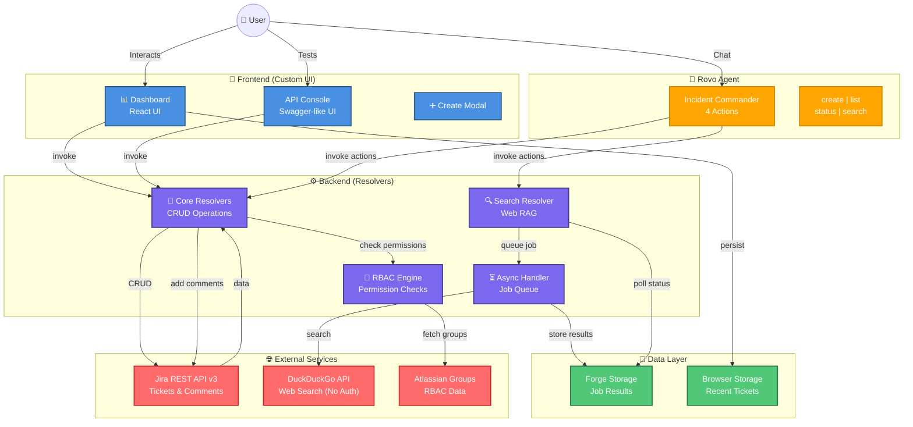

# 🚨 Incident War Room - Advanced Jira Incident Management

[](https://developer.atlassian.com/platform/forge/)
[](https://github.com/samalpartha/incident-war-room)
[](LICENSE)

A professional, production-ready Atlassian Forge app for incident management with AI-powered capabilities, advanced RBAC, and comprehensive audit trails.

---

## 🏗️ Architecture



---

## ✨ Features (All Working!)

| Feature | Description | Status |
|---------|-------------|--------|
| 📊 **Dashboard UI** | Real-time incident tracking with inline editing | ✅ Working |
| 🔐 **RBAC** | 4-role permission system (Admin, Manager, Responder, Viewer) | ✅ Working |
| 📝 **Timeline Comments** | Auto-audit trail for create/update/delete | ✅ Working |
| 🎛️ **API Console** | Swagger-like testing interface | ✅ Working |
| 🔍 **Web Search RAG** | DuckDuckGo integration for solutions | ✅ Working |
| ⏳ **Async AI Pattern** | No-timeout job queue for long operations | ✅ Working |
| 🤖 **Rovo Agent** | "Incident Commander" with 4 actions + input schemas | ✅ Working |

---

## 🚀 Quick Start

### Prerequisites
- [Forge CLI](https://developer.atlassian.com/platform/forge/cli-reference/) installed
- Atlassian account with Jira access
- Node.js 18+ and npm

### Installation

```bash
# Clone repository
git clone https://github.com/samalpartha/incident-war-room.git
cd incident-war-room

# Install dependencies
npm install
cd static/dashboard && npm install && cd ../..

# Login to Forge
forge login

# Deploy app
forge deploy

# Install to your Jira site
forge install
```

### Configuration

**RBAC Groups (Optional but Recommended):**
Create these Atlassian groups in your organization:
- `incident-admins` - Full control
- `incident-managers` - Create, update, view
- `incident-responders` - Create, view  
- `incident-viewers` - View only

> **Note: If groups don't exist, app defaults to permissive mode (all users have all permissions)**

###  API Keys Required
**NONE!** 🎉  
- Jira API: Uses Forge auth (automatic)
- DuckDuckGo: Free, no authentication needed
- Forge Storage: Built-in, no setup required

---

## 📖 Usage

### Dashboard
1. Navigate to **Jira** → **Apps** → **Incident War Room**
2. View all incidents with status, assignee, timestamps
3. **Create** incidents via modal (+ button)
4. **Edit** summaries inline (pencil icon)
5. **Delete** incidents (trash icon)
6. **Filter** by project or "assigned to me"
7. **Refresh** manually with button

### API Console
1. Click "**API Console**" tab
2. Select operation (Create/List/Get/Delete)
3. Fill parameters with dropdowns & templates
4. Execute and view formatted responses
5. Use "**View on Dashboard**" to navigate

### Rovo Agent
1. Open **Rovo Chat** in Jira
2. Select "**Incident Commander**" agent
3. Try conversation starters:
   - "🚨 Create a critical database incident"
   - "📋 Show me all active incidents"
   - "🔍 Search for Redis connection timeout solutions"
4. Natural language works too!

---

## 🔐 RBAC Permission Matrix

| Action | Admin | Manager | Responder | Viewer |
|--------|-------|---------|-----------|--------|
| View incidents | ✅ | ✅ | ✅ | ✅ |
| Create incidents | ✅ | ✅ | ✅ | ❌ |
| Update incidents | ✅ | ✅ | ❌ | ❌ |
| Delete incidents | ✅ | ❌ | ❌ | ❌ |
| Configure RBAC | ✅ | ❌ | ❌ | ❌ |

---

## 🛠️ Technical Details

### Stack
- **Frontend**: React 18, @forge/bridge, Custom UI
- **Backend**: Forge Resolver, Node.js 24.x
- **APIs**: Jira REST API v3, DuckDuckGo search
- **Storage**: Forge Storage (async jobs), Browser localStorage (persistence)
- **Deployment**: Atlassian Forge Platform

### Project Structure
```
incident-war-room/
├── src/
│   ├── resolvers/
│   │   ├── index.js          # Main resolvers (CRUD + RBAC)
│   │   └── async-search.js   # Async web search handler
│   └── utils/
│       ├── permissions.js    # RBAC logic
│       └── search.js         # DuckDuckGo integration
├── static/dashboard/         # React frontend
│   └── src/
│       ├── App.js            # Main dashboard component
│       ├── components/       # UI components
│       └── services/api.js   # Forge bridge API calls
├── prompts/
│   └── agent-prompt.md       # Rovo Agent system prompt
└── manifest.yml              # Forge app configuration
```

### Key APIs Used
- **Jira API**: 
  - `/rest/api/3/issue` (create, update, delete)
  - `/rest/api/3/search` (JQL queries)
  - `/rest/api/3/issue/{key}/comment` (timeline comments)
  - `/rest/api/3/myself` (current user)
  - `/rest/api/3/user/search` (assignees)
- **Forge Storage API**: Job state persistence
- **Forge Events API**: Async job queue
- **DuckDuckGo Instant Answer API**: Web search (free)

### Performance
- **Dashboard Load**: < 2s (includes Jira API + persistence merge)
- **Incident Creation**: < 1s
- **Web Search (async)**: 5-10s (non-blocking)
- **RBAC Check**: < 100ms (cached groups)

---

## 🧪 Development

### Local Development
```bash
# Start tunnel for local testing
forge tunnel

# Open app in Jira (separate terminal)
# Your app will hot-reload on code changes
```

### Build Frontend
```bash
cd static/dashboard
npm run build
cd ../..
```

### Deploy Changes
```bash
forge deploy
# Optionally upgrade installation if scopes changed
forge install --upgrade
```

### View Logs
```bash
forge logs
# Real-time logs for debugging
```

---

## 📊 Monitoring

### Check Deployment
```bash
forge install --upgrade  # Ensure latest version


forge whoami              # Verify logged-in account
```

### App Metrics
- Deployment version: **7.5.0**
- Functions: 3 (resolver, async-search, poll)
- Scopes: 8 (Jira read/write, groups, storage)
- Modules: Dashboard, API Console, Rovo Agent

---

##  Troubleshooting

### Dashboard Not Loading
1. Check Forge logs: `forge logs`
2. Verify app installed: `forge install list`
3. Refresh browser hard: Cmd+Shift+R (Mac) / Ctrl+Shift+F5 (Windows)

### Permission Errors
1. Verify RBAC groups exist in Atlassian Admin
2. Check user is in correct group
3. Default is permissive if groups missing

### Rovo Agent Not Visible
1. Ensure Rovo Chat enabled (admin.atlassian.com)
2. Try direct URL: `https://[your-site].atlassian.net/chat`
3. Run `forge install --upgrade`

### Search Not Working
1. Check `forge logs` for DuckDuckGo errors
2. Verify network connectivity
3. Poll `poll-job-result` resolver with jobId

---

## 🎯 Roadmap

- [ ] Multi-threaded async search (parallel queries)
- [ ] Custom dashboard widgets
- [ ] Incident templates
- [ ] SLA tracking & alerting
- [ ] Slack/Teams integration
- [ ] Advanced analytics dashboard

---

## 📄 License

MIT License - see [LICENSE](LICENSE) file

---

## 🙏 Acknowledgments

- Built with [Atlassian Forge](https://developer.atlassian.com/platform/forge/)
- Inspired by [forge-ai-sprint-builder](https://bitbucket.org/atlassian/forge-ai-sprint-builder/)
- Search powered by [DuckDuckGo API](https://duckduckgo.com/api)

---

## 📞 Support

- **Issues**: [GitHub Issues](https://github.com/samalpartha/incident-war-room/issues)
- **Docs**: [Forge Documentation](https://developer.atlassian.com/platform/forge/)
- **Community**: [Atlassian Community](https://community.atlassian.com/)

---

<div align="center">

**Made with ❤️ for Incident Response Teams**

[⭐ Star on GitHub](https://github.com/samalpartha/incident-war-room) | [Report Bug](https://github.com/samalpartha/incident-war-room/issues) | [Request Feature](https://github.com/samalpartha/incident-war-room/issues)

</div>
