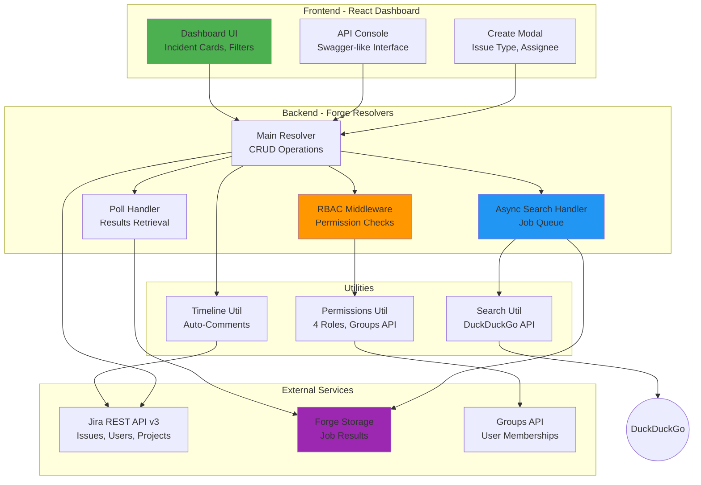

# 🚨 Incident War Room

**AI-Powered Incident Management for Atlassian**

A production-ready Atlassian Forge app that transforms incident response with Role-Based Access Control, intelligent automation, and comprehensive audit trails.

[](https://developer.atlassian.com/platform/forge/)
[](https://nodejs.org/)
[](LICENSE)

---

## 🎯 What It Does

Incident War Room centralizes critical incident management across your Atlassian ecosystem with:

- **🎨 Real-time Dashboard** - Visual incident tracking with live updates
- **🛡️ Enterprise RBAC** - Role-based permissions using Atlassian Groups
- **🤖 AI-Powered Search** - Web search integration for troubleshooting solutions
- **📝 Automatic Audit Trail** - Timeline comments for every action
- **⚡ Async Operations** - Robust long-running task handling
- **🔧 API Console** - Interactive testing environment

---

## 🏗️ Architecture



---

## ✨ Features

### 🎨 Dashboard & UI
- **Incident Cards** - Status badges, assignee avatars, timestamps
- **Real-time Filters** - Project filter, "My Incidents" toggle
- **Quick Actions** - Pit Crew status, runbook links
- **Responsive Design** - Works on desktop and tablet
- **Dark Theme** - Modern glassmorphism aesthetic

### 🛡️ Role-Based Access Control (RBAC)
- **4 Roles**: Incident Commander, On-Call Engineer, Developer, Observer
- **Granular Permissions**: create, update, delete, view, comment
- **Atlassian Groups Integration**: Uses native Jira groups
- **Conditional UI**: Buttons show/hide based on permissions
- **Role Badge**: Displays user's role in header
- **Default Access**: Full access for users not in RBAC groups

**Permission Matrix:**

| Role | Create | Update | Delete | View |
|------|--------|--------|--------|------|
| Incident Commander | ✅ | ✅ | ✅ | ✅ |
| On-Call Engineer | ✅ | ✅ | ❌ | ✅ |
| Developer | ❌ | ❌ | ❌ | ✅ |
| Observer (default) | ✅ | ✅ | ✅ | ✅ |

### 📝 Timeline Auto-Comments
- **Creation Comments**: "🚨 Incident created via War Room at [timestamp]"
- **Update Comments**: "✏️ Summary updated... New summary: [text]"
- **Deletion Comments**: "🗑️ Incident closed via War Room at [timestamp]"
- **Jira Activity Integration**: All comments visible in ticket Activity tab
- **Graceful Fallback**: Comments don't block main operations

### 🤖 AI & Search
- **Web Search RAG**: DuckDuckGo integration for troubleshooting
- **Async Pattern**: No timeout issues for slow searches
- **Job Queue**: Forge event system with polling
- **Results Storage**: Forge Storage for job state
- **Rovo Agent** (if enabled): Natural language incident management

### ⚡ Async Operations
- **Long-Running Tasks**: Based on `forge-ai-sprint-builder` pattern
- **Job Queue**: Fire-and-forget with`@forge/events`
- **Polling Mechanism**: Frontend polls for completion
- **Forge Storage**: Persistent job results
- **Error Handling**: Graceful failure with stored error states

### 🔧 API Console
- **Interactive Testing**: Swagger-like UI for all resolvers
- **Request Builder**: Dropdowns for projects, issue types, users
- **Response Inspector**: JSON viewer with syntax highlighting
- **Quick Actions**: "View on Dashboard" button
- **Templates**: Pre-filled examples for common operations

---

## 🚀 Quick Start

### Prerequisites
- **Atlassian Account** with Jira access
- **Node.js 22.x** or higher
- **Forge CLI**: `npm install -g @forge/cli`
- **Forge Tunnel** (for development)

### Installation

```bash
# Clone repository
git clone https://github.com/yourusername/incident-war-room.git
cd incident-war-room

# Install dependencies
npm install

# Login to Forge
forge login

# Deploy to development
forge deploy

# Install on your Jira site
forge install

# Start tunnel for local development (optional)
forge tunnel
```

### Configuration

#### 1. Required Permissions
The app requests these scopes (granted automatically):
- `read:jira-work` - Read Jira issues
- `write:jira-work` - Create/update issues
- `read:jira-user` - Fetch users and groups (for RBAC)
- `storage:app` - Store async job results
- `read:chat:rovo` - Rovo Agent integration (optional)
- `read:confluence-content.all` - Confluence support

#### 2. RBAC Setup (Optional)
To use role-based permissions:

```bash
# In Jira Admin → Groups, create:
- incident-commanders
- oncall-engineers
- developers
- observers

# Add users to groups
# Users not in any group get full access (backward compatible)
```

### 3. API Keys (None Required!)
**No API keys needed!** The app uses:
- **DuckDuckGo** - Free, no authentication
- **Jira API** - Authenticated via Forge automatically
- **Forge Storage** - Built-in, no setup

---

## 📖 Usage

### Creating Incidents
1. Click **🔔 DECLARE** button (if you have `create` permission)
2. Fill in summary, description
3. Select project, issue type, assignee
4. Submit → Incident created with timeline comment

### Viewing Incidents
- **Dashboard**: All incidents with filters
- **Jira**: Click "Open in Jira" button
- **Activity Tab**: See timeline comments

### Using API Console
1. Click **⚙️ API Console** tab
2. Select function (e.g., `createIncident`)
3. Fill parameters using dropdowns
4. Click "Execute" → See response

### RBAC Permissions
- **Role Badge**: Shows your role in header
- **Conditional Buttons**: Only see actions you can perform
- **Permission Errors**: Clear messages if action denied

---

## 🛠️ Development

### Project Structure
```
incident-war-room/
├── src/
│   ├── resolvers/
│   │   ├── index.js           # Main resolvers
│   │   └── async-search.js    # Async search handler
│   └── utils/
│       ├── permissions.js     # RBAC logic
│       └── search.js          # Web search utility
├── static/dashboard/
│   └── src/
│       ├── App.js             # Main React component
│       ├── components/        # UI components
│       └── services/
│           └── api.js         # Forge bridge API
├── prompts/
│   └── agent-prompt.md        # Rovo Agent prompt
├── manifest.yml               # Forge app configuration
└── package.json
```

### Building Frontend
```bash
cd static/dashboard
npm run build
cd ../..
forge deploy
```

### Testing
```bash
# Manual testing via API Console
# 1. Deploy app
# 2. Open Jira → Incident War Room
# 3. Go to API Console tab
# 4. Test each resolver

# Check logs
forge logs
```

### Deployment
```bash
# Deploy to development
forge deploy

# Deploy to production
forge deploy -e production

# Install/upgrade
forge install --upgrade
```

---

## 📊 Technical Details

### Tech Stack
- **Runtime**: Node.js 22.x
- **Frontend**: React 18, Custom UI (iframe)
- **Backend**: Forge Resolver API
- **Storage**: Forge Storage API
- **Events**: Forge Events (async queue)
- **Styling**: Vanilla CSS with CSS variables

### Performance
- **Async Operations**: No 25-second timeout limit
- **Job Queue**: Event-driven architecture
- **Storage**: Key-value persistence for job results
- **Polling**: 2-second intervals with exponential backoff

### Security
- **RBAC**: Server-side permission checks
- **Scoped API**: All calls use `asUser()` context
- **Group-based**: Leverages Atlassian's native groups
- **Graceful Defaults**: Full access if no groups configured

---

## 🎓 Learn More

### Key Patterns Used
1. **Async Event Pattern** - From `forge-ai-sprint-builder`
2. **RBAC Middleware** - Permission checks on every CUD operation
3. **Timeline Pattern** - Auto-commenting for audit trail
4. **Job Queue** - Fire-and-forget with polling

### Forge Documentation
- [Getting Started](https://developer.atlassian.com/platform/forge/getting-started/)
- [Custom UI](https://developer.atlassian.com/platform/forge/custom-ui/)
- [Storage API](https://developer.atlassian.com/platform/forge/runtime-reference/storage-api/)
- [Events API](https://developer.atlassian.com/platform/forge/runtime-reference/async-events-api/)

### Inspiration
- [forge-ai-sprint-builder](https://github.com/dugaldmorrow/forge-ai-sprint-builder) - Async pattern
- Atlassian Forge examples

---

## 🤝 Contributing

Contributions welcome! Please:
1. Fork the repository
2. Create a feature branch
3. Make your changes
4. Test thoroughly
5. Submit a pull request

---

## 📜 License

MIT License - see [LICENSE](LICENSE) file

---

## 🙏 Acknowledgments

- Atlassian Forge team for the excellent platform
- `forge-ai-sprint-builder` for async pattern inspiration
- Community for feedback and testing

---

## 📞 Support

- **Issues**: [GitHub Issues](https://github.com/yourusername/incident-war-room/issues)
- **Docs**: This README
- **Community**: [Atlassian Developer Community](https://community.developer.atlassian.com/)

---

**Built with ❤️ using Atlassian Forge**
