# 🤖 Rovo Autonomous Team Orchestrator
### *The Next-Generation AI Command Center for DevOps*

   

> **2025 Hackathon Edition**
> **Theme:** "Agentic AI & Autonomous Workflows"

---

## 🚀 Overview
**Rovo Autonomous Team Orchestrator** is a production-grade AI Agent suite designed to proactively manage Jira projects. Unlike passive chatbots that only answer questions, this system **takes action**. It serves as a unified "Mission Control" for engineering teams, leveraging **Atlassian Rovo** and the **Model Context Protocol (MCP)** to autonomously fix tickets, assign work, and manage incidents.

---

## ⚡️ Architecture 2025

### 1. High-Level System Design
The system bridges the gap between conversational AI (Rovo/Claude) and structured DevOps data (Jira).

```mermaid
flowchart TD
    subgraph Frontend ["🖥️ User Interfaces"]
        direction TB
        UI1[💬 Rovo Chat]:::ui
        UI2[🖥️ React Dashboard]:::ui
        UI3[💻 VS Code / Cursor]:::ui
    end

    subgraph Backend ["⚡️ Orchestration Layer (Forge)"]
        direction TB
        Resolver{⚡️ FaaS Resolvers}:::core
        Agent[🤖 Rovo Agents]:::core
        MCP[🔌 MCP Interface]:::core
        
        Resolver <--> Agent
        Resolver <--> MCP
    end

    subgraph Intelligence ["🧠 Intelligence & Execution"]
        direction LR
        AutoFix[✨ Auto-Fix Agent]:::ai
        Assign[👤 Smart Assigner]:::ai
        SLA[⏱️ SLA Predictor]:::ai
        Chaos[🐵 Chaos Monkey]:::ai
    end

    subgraph Data ["💾 Data Persistence"]
        Jira[(☁️ Jira Cloud)]:::db
        Storage[(📦 Forge Storage)]:::db
    end

    %% Connections
    UI1 & UI2 --> Resolver
    UI3 -->|MCP Protocol| Resolver
    
    Resolver --> Jira
    Resolver --> Storage
    
    Agent --> AutoFix & Assign & SLA & Chaos
    Chaos --> Jira
    
    %% Styling
    classDef ui fill:#e3f2fd,stroke:#1565c0,stroke-width:2px,color:#0d47a1
    classDef core fill:#fff3e0,stroke:#e65100,stroke-width:2px,color:#e65100
    classDef ai fill:#f3e5f5,stroke:#7b1fa2,stroke-width:2px,color:#7b1fa2
    classDef db fill:#e8f5e9,stroke:#2e7d32,stroke-width:2px,color:#1b5e20
```



### 2. Autonomous Incident Lifecycle (Flowchart)
How the system autonomously handles a new vague ticket from creation to assignment.

```mermaid
flowchart LR
    Start([🎫 New Ticket Created]):::start
    
    subgraph Validation [" Phase 1: Quality Check "]
        direction TB
        Check{Detailed?}
        AutoFix[✨ Auto-Fix Agent]:::action
        Update[📝 Update Jira]:::update
    end
    
    subgraph Planning [" Phase 2: AI Triage "]
        direction TB
        SLA{⚠️ Risk Level?}
        High[🔥 High Priority]:::danger
        Normal[✅ Normal Priority]:::safe
    end
    
    subgraph Assignment [" Phase 3: Smart Routing "]
        direction TB
        Load{🔍 Team Load}
        Assign[🤝 Assign Best Dev]:::success
    end

    %% Flow
    Start --> Check
    Check -->|No| AutoFix --> Update --> SLA
    Check -->|Yes| SLA
    
    SLA -->|Urgent| High --> Load
    SLA -->|Standard| Normal --> Load
    
    Load --> Assign
    
    %% Styling
    classDef start fill:#e1f5fe,stroke:#01579b,stroke-width:2px
    classDef action fill:#fff9c4,stroke:#fbc02d,stroke-width:2px
    classDef update fill:#f0f4c3,stroke:#c0ca33,stroke-width:2px
    classDef danger fill:#ffcdd2,stroke:#c62828,stroke-width:2px,color:#b71c1c
    classDef safe fill:#c8e6c9,stroke:#388e3c,stroke-width:2px,color:#1b5e20
    classDef success fill:#dcedc8,stroke:#558b2f,stroke-width:4px,color:#33691e
```



### 3. Smart Assign Logic (Detailed Flow)
The exact logic used to calculate workload and assign tickets.

```mermaid
flowchart TD
    Start([👤 User Request: 'Smart Assign']):::start
    Fetch[📥 Fetch Assignable Users]
    
    subgraph Filtering ["🧹 Filter Candidates"]
        IsHuman{Is User Human?}
        Ignored([🚫 Discard Bot/App]):::gray
    end
    
    subgraph Workload ["🧮 Workload Calculation"]
        Loop[🔁 For Each Human User]
        Query[🔍 POST /rest/api/3/search/jql]
        Count{🔢 Count Issues}
        Busy[⚠️ Error/Busy: Set 999]:::busy
        Real[✅ Success: Set Actual Count]:::good
    end
    
    subgraph Decision ["🤝 Final Decision"]
        Collect[📥 Collect Results]
        Sort[📉 Sort by Count ASC]
        Pick[🏆 Pick Top Candidate]
        Action[✍️ Update Jira Assignee]:::done
    end

    Start --> Fetch --> Loop
    Loop --> IsHuman
    IsHuman -->|No| Ignored
    IsHuman -->|Yes| Query
    
    Query --> Count
    Count -->|Errors| Busy
    Count -->|Success| Real
    
    Real & Busy --> Collect
    Collect --> Sort
    Sort --> Pick --> Action
    
    %% Styling
    classDef start fill:#dae8fc,stroke:#6c8ebf
    classDef gray fill:#f5f5f5,stroke:#999,stroke-dasharray: 5 5,color:#999
    classDef busy fill:#f8cecc,stroke:#b85450
    classDef good fill:#d5e8d4,stroke:#82b366
    classDef done fill:#d5e8d4,stroke:#82b366,stroke-width:4px
```



---

## 🛠️ Key Features

### 1. 🖥️ The Orchestrator Control Center
A production-grade React dashboard hosted directly within Jira.
-   **Live Incident Feed:** Real-time WebSocket-like polling for active incidents.
-   **Glassmorphism UI:** Modern, responsive design with dark mode support.
-   **Chaos Monkey:** Built-in resilience testing tool that simulates production outages.

### 2. 🤖 Rovo Agents
Autonomous agents that live in the sidebar and chat.
-   **Auto-Fix:** Instantly rewrites vague descriptions into structured requirements.
-   **Smart Assign:** Balances team workload by assigning to the user with the fewer active tickets (lowest load).
-   **Subtask Generator:** Breaks down epics into implementation plans.
-   **SLA Breach Prediction:** AI-driven analysis of ticket age and priority to predict breach risks (Available via Rovo & Dashboard).

### 3. 🛡️ QA Command Center
Built-in quality assurance tools to ensure reliability.
-   **Incident War Room:** A live "Mission Control" providing real-time agent status and system connectivity checks (`/qa-dashboard.html`).
-   **100% Test Coverage:** Enforced by CI/CD pipelines.
-   **E2E Simulation:** A live "Self-Health" check available directly in the dashboard.

### 4. ✅ Rovo Use Case Alignment
We strictly adhere to [Atlassian's official Rovo Use Cases](https://www.atlassian.com/software/rovo/use-cases):

| Official Rovo Use Case | Our Implementation | Status |
| :--- | :--- | :--- |
| **Readiness Checker** | **Auto-Fix Agent:** Rewrites vague tickets to ensure "Ready for Dev" status (ACs + Steps). | 🟢 Live |
| **Issue Organizer** | **Smart Assign Agent:** Automatically routes tickets to the right person based on workload. | 🟢 Live |
| **Release Notes Drafter** | **Release Notes Agent:** Aggregates 'Done' tickets into published release docs. | 🟢 Live |
| **Triage Assistant** | **SLA Predictor:** Proactively identifies "At Risk" tickets before they breach. | 🟢 Live |
| **Blocked Ticket Viewer** | **Incident Feed:** Surfaces stalled or high-priority items instantly. | 🟢 Live |

---

## 👩‍💻 Developer Setup

### Prerequisites
*   Node.js 22+
*   Atlassian Forge CLI (`npm install -g @forge/cli`)
*   Docker (Optional, for local MCP server)

### 1. Installation
```bash
# Clone the repository
git clone https://github.com/samalpartha/incident-war-room.git
cd incident-war-room

# Install dependencies (Root + Dashboard)
npm install
cd static/dashboard && npm install && cd ../..
```

### 2. Local Development (Proxy Mode)
We utilize a custom proxy server to mock Atlassian APIs, enabling rapid local UI development.
```bash
# Start the Proxy Server + React App
npm run proxy

```
*   **App URL:** `http://localhost:8080/qa-dashboard.html`
*   **API Mock:** `http://localhost:8080/`

### 3. Testing Quality Gates
```bash
# Unit Tests (Jest)
npm test

# End-to-End Simulation
npm run simulate
```

---

## 🛡️ AI Safety & Guardrails
Trust is critical for agentic systems. We implement strict guardrails:
1.  **Dry-Run Mode:** All destructive actions (e.g., Chaos Monkey) have a simulation mode for safe testing.
2.  **Scope Limiting:** Agents are restricted to specific Projects (e.g., `KAN`) to prevent cross-project contamination.
3.  **Human-in-the-Loop:** Critical decisions (e.g., locking deploys) require explicit user confirmation via the Dashboard UI.
4.  **Audit Logging:** Every AI action is logged to the "Activity Feed" with a clear reason ("Assigned to Alice because...").

---

## 🏗️ Technology Stack
| Component | Technology | Description |
|-----------|------------|-------------|
| **Platform** | Atlassian Forge | Serverless FaaS infrastructure |
| **Frontend** | React 18 | Dashboard UI with `@forge/bridge` |
| **Styling** | Vanilla CSS | High-performance variables & dark mode |
| **AI Protocol** | MCP | Model Context Protocol for external agents |
| **Testing** | Jest | 100% Unit Test Coverage |

---
*Built for the Future of Work. 2025.*
